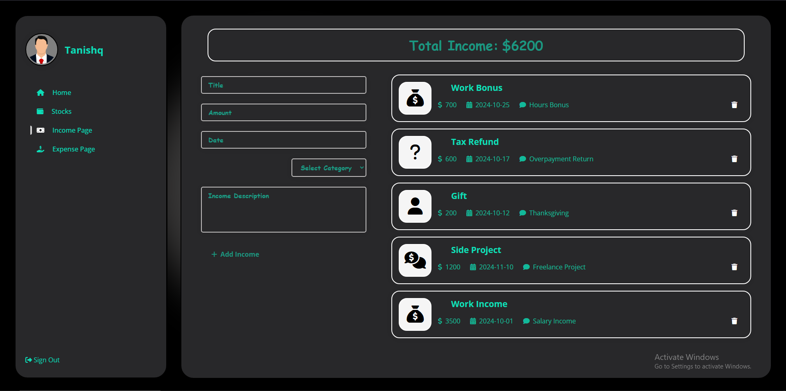

# Tanishq Mehta

## Finance App

A simple finance budgeting app that helps users manage their income, expenses, and visualize financial data through charts. The app integrates with a stock price API, allowing users to view stock prices and track their spending habits.

## Tech Stack

- **MongoDB**: Used for storing user data, transactions, and financial records.
- **Express**: Web framework for Node.js used to build the API and handle server-side logic.
- **React.js**: Frontend framework for building the user interface and handling user interactions.
- **Node.js**: JavaScript runtime for executing backend logic.
- **Chart.js**: Used to visualize stock graphs & transactions
- **Polygon.io** API to fetch stock data

## Features

- **View Stock Prices**: Displays current stock prices by fetching data from an external API.
- **Add Income**: Allows users to log their sources of income.
- **Add Expenses**: Lets users record their expenses.
- **Manage Transactions**: View and manage all income/expense transactions.
- **Visualize Spending**: Uses Chart.js to visualize financial data and trends, such as monthly income and expenses.

## Goal

The goal of this project is to help users track and budget their finances by providing an easy-to-use platform to manage income and spending. Users can also visualize their financial data to make informed decisions. Moreover, users are able to easily check stocks while budgeting their finances.

## Dev Goal

This project was built with the intention of learning:
- How to integrate and use external APIs (for stock data)
- React.js basics for frontend development
- CSS implementation for a responsive design
- Working with NoSQL databases (MongoDB) for storing and managing data

## Project Overview:

- Initial Homepage that allows users to view all transactions, as well as their outstanding balance:

- Stock search feature that allows users to obtain real-time stock data based on local time.

### Example 1

### Example 2

- Income page which allows users to add/delete positive transactions

- Expense page which allows users to add/delete negative transactions

- Video Demo can be found here:
https://youtu.be/pS-r3tcCcGY

